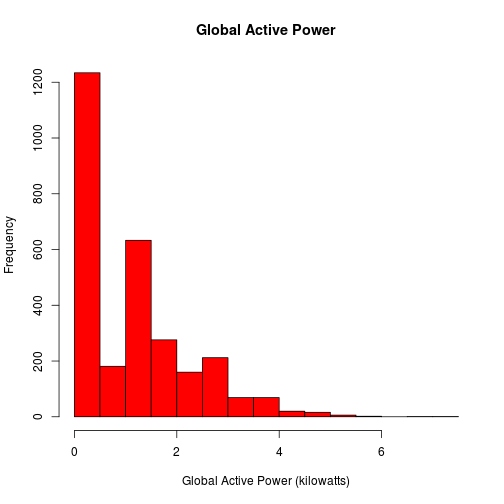
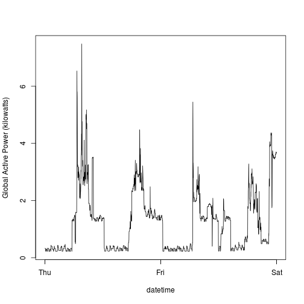
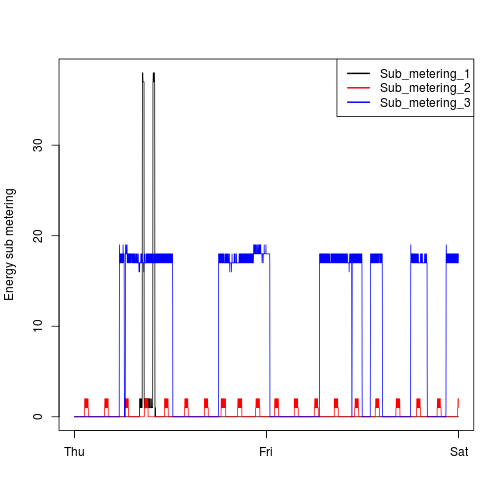
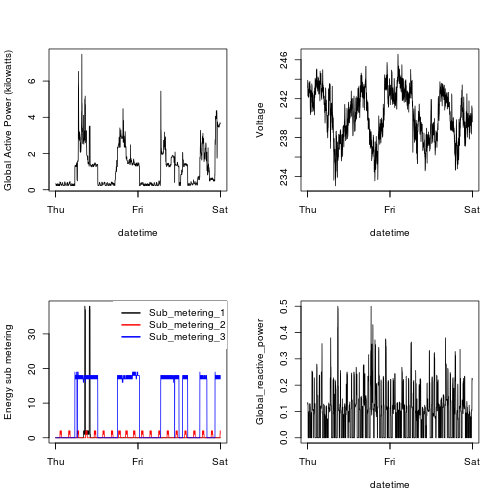

Exploratory Data Analysis Peer Assessment 1
========================================================

So I've used Knitr to complete the assignment, which gives a unified view of the plots and code. However, the assignment specifically requires separate files in R and separate PNG files at 480 x 480, so to be compliant, I've provided both. You can either use the readme which has all the plots/code together, or go into each separate file. Technically, the assignment says I have to provide separate files, just thought KNITR was easier so used it. 

The PNGs in the main folder are saved at 480 x 480, though the Readme has KNITR versions which are slightly larger. My code does export themas 480 x 480 so please grade as such, and 480 x 480 is the true size of the PNG files.

First step, we load the data in, set working directory, load it into a cariable, create a true date column, subset to the desired date range, then create a datetime column for the graphs. Then we proceed to create the plots!


```r
setwd("~/explorpa1/")
url <- "https://d396qusza40orc.cloudfront.net/exdata%2Fdata%2Fhousehold_power_consumption.zip"
download.file(url,"power.zip",method="curl",cacheOK=TRUE)
unzip("power.zip",  overwrite = TRUE,
       exdir = "./data", unzip = "internal",
      setTimes = FALSE)
power <- read.csv("./data/household_power_consumption.txt",sep=";",na.strings="?")
power$Date2 <- as.Date(power$Date,"%d/%m/%Y")
powersubset <- power[which(power$Date2 >= "2007-02-01" & power$Date2 <= "2007-02-02"),]
powersubset$Time2 <- strptime(powersubset$Time,format="%H:%M:%S")
powersubset$datetime <-  paste(powersubset$Date, powersubset$Time)
powersubset$datetime <-  strptime(powersubset$datetime, "%d/%m/%Y %H:%M:%S") 
```

Plot 1


```r
par(bg="white")
options(scipen=999)
hist(powersubset$Global_active_power,col="red",xlab="Global Active Power (kilowatts)",main="Global Active Power")
```

 

```r
dev.copy(png, file = "plot1.png" ,width = 480, height = 480) 
```

```
## png 
##   3
```

Plot 2


```r
par(bg="white")
with(powersubset,plot(datetime,Global_active_power,type="l",col="black",ylab="Global Active Power (kilowatts)"))
```

 

```r
dev.copy(png, file = "plot2.png" ,width = 480, height = 480) 
```

```
## png 
##   4
```

Plot 3


```r
par(bg="white")
with(powersubset,plot(datetime,Sub_metering_1,type="l",col="black",xlab="",ylab="Energy sub metering"))
with(powersubset,lines(datetime,Sub_metering_2,type="l",col="red"))
with(powersubset,lines(datetime,Sub_metering_3,type="l",col="blue"))
  legend("topright", lty=1, lwd=2,
        col = c("black","red","blue"), 
        legend = c("Sub_metering_1", "Sub_metering_2", "Sub_metering_3"))
```

 

```r
dev.copy(png, file = "plot3.png" ,width = 480, height = 480) 
```

```
## png 
##   5
```

Plot 4


```r
par(bg="white")
par(mfcol=c(2,2))
with(powersubset,plot(datetime,Global_active_power,type="l",col="black",ylab="Global Active Power (kilowatts)"))
with(powersubset,plot(datetime,Sub_metering_1,type="l",col="black",xlab="",ylab="Energy sub metering"))
with(powersubset,lines(datetime,Sub_metering_2,type="l",col="red"))
with(powersubset,lines(datetime,Sub_metering_3,type="l",col="blue"))
legend("topright", lty=1, lwd=2, box.lwd=0,
       col = c("black","red","blue"), 
       legend = c("Sub_metering_1", "Sub_metering_2", "Sub_metering_3"))
with(powersubset,plot(datetime,Voltage,type="l",col="black"))
with(powersubset,plot(datetime,Global_reactive_power,type="l",col="black"))
```

 

```r
dev.copy(png, file = "plot4.png" ,width = 480, height = 480) 
```

```
## png 
##   6
```
